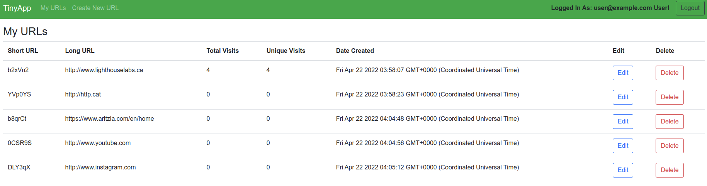
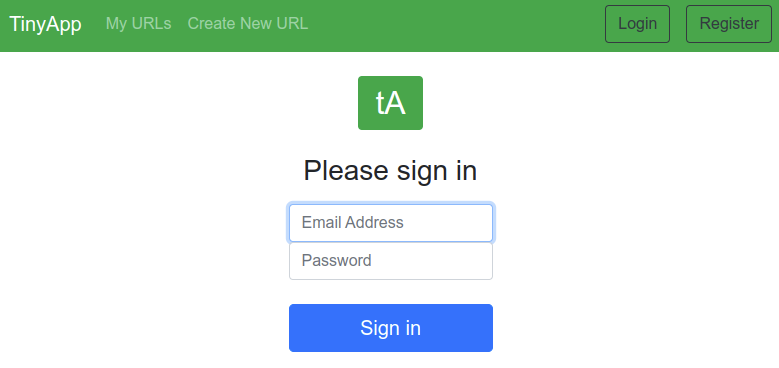
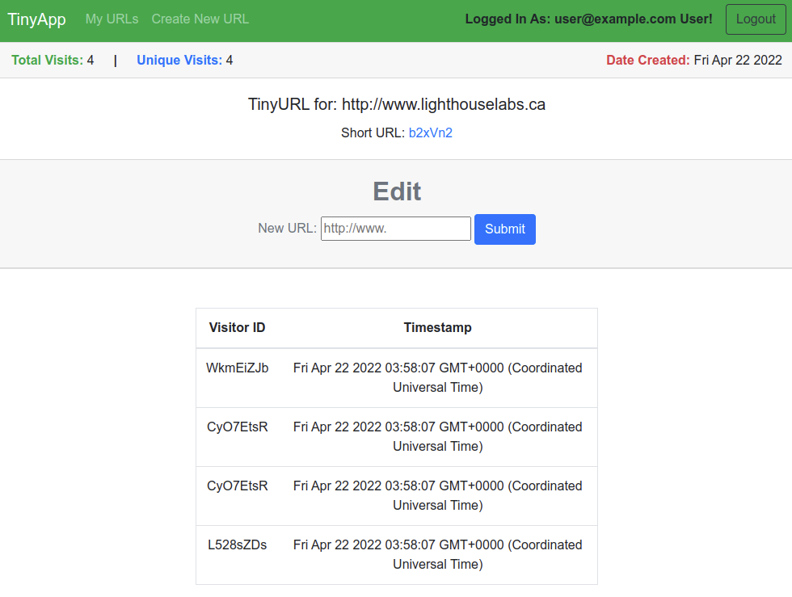

# TinyApp Project

TinyApp is a full stack web application built with Node and Express that allows users to shorten long URLs (à la bit.ly).

## Final Product

### Main URL Page


### Registration Page


### Login Page


### Edit Page


## Built With
 - [Bootstrap](https://getbootstrap.com/)

## Dependencies

- [Node.js](https://docs.npmjs.com/downloading-and-installing-node-js-and-npm#overview)
- [Express](https://www.npmjs.com/package/express)
- [EJS](https://www.npmjs.com/package/ejs)
- [bcrypt](https://www.npmjs.com/package/bcryptjs)
- [body-parser](https://www.npmjs.com/package/body-parser)
- [cookie-session](https://www.npmjs.com/package/cookie-session)


## Getting Started

In order to run this application, you will need to have NPM installed. If you do not know what NPM is or would like to learn more about it, visit this [website](https://docs.npmjs.com/about-npm).

### Installation

_Prior to installation make sure you go into the directory where you would like TinyApp to reside._ 

1. Clone the repo
  ```
  git clone https://github.com/your_username/tinyapp.git
  ```
2. Inside the tinyapp directory, install all dependencies
  ```
  npm install
  ```
3. Start the development web server
  ```
  npm start
  ```

## Usage

Once the server is running, you will be able to register and login as a new user. The following features are available once you are logged in:
- Create a new shortened link
- Visit shortened link
- View a list of all shortened list.
- Edit url assigned to each generated shortened url
- Delete existing shortened urls
- View more detailed information for a shortened url such as number of visits and date created.

Keep in mind that permissions to __Edit__, __Delete__ and __View__ for each shortened url is only given to the original author.

## Roadmap

:heavy_check_mark: Shortened URL list page

:heavy_check_mark: Create New Shortened URL

:heavy_check_mark: View, Edit and Delete Shortened URL

:heavy_check_mark: Registration and Login

:heavy_check_mark: Password Security and Cookie Encryption

:heavy_check_mark: Analytics for View Count and Visitor List per shortened url

:white_check_mark: Complete tests for helper functions

:white_check_mark: Persistent data transfered to a database like sqlite instead of objects


